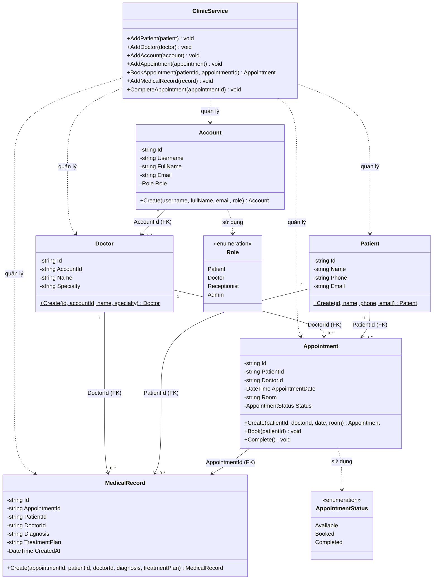

```mermaid
classDiagram
    class Patient {
        -string Id
        -string Name
        -string Phone
        -string Email
        +Create(id, name, phone, email)$ Patient
    }

    class Doctor {
        -string Id
        -string AccountId
        -string Name
        -string Specialty
        +Create(id, accountId, name, specialty)$ Doctor
    }

    class Appointment {
        -string Id
        -string PatientId
        -string DoctorId
        -DateTime AppointmentDate
        -string Room
        -AppointmentStatus Status
        +Create(patientId, doctorId, date, room)$ Appointment
        +Book(patientId) void
        +Complete() void
    }

    class MedicalRecord {
        -string Id
        -string AppointmentId
        -string PatientId
        -string DoctorId
        -string Diagnosis
        -string TreatmentPlan
        -DateTime CreatedAt
        +Create(appointmentId, patientId, doctorId, diagnosis, treatmentPlan)$ MedicalRecord
    }

    class Account {
        -string Id
        -string Username
        -string FullName
        -string Email
        -Role Role
        +Create(username, fullName, email, role)$ Account
    }

    class ClinicService {
        +AddPatient(patient) void
        +AddDoctor(doctor) void
        +AddAccount(account) void
        +AddAppointment(appointment) void
        +BookAppointment(patientId, appointmentId) Appointment
        +AddMedicalRecord(record) void
        +CompleteAppointment(appointmentId) void
    }

    class AppointmentStatus {
        <<enumeration>>
        Available
        Booked
        Completed
    }

    class Role {
        <<enumeration>>
        Patient
        Doctor
        Receptionist
        Admin
    }

    Account "1" --> "0..1" Doctor : AccountId (FK)
    Patient "1" --> "0..*" Appointment : PatientId (FK)
    Doctor "1" --> "0..*" Appointment : DoctorId (FK)
    Appointment "1" --> "0..1" MedicalRecord : AppointmentId (FK)
    Patient "1" --> "0..*" MedicalRecord : PatientId (FK)
    Doctor "1" --> "0..*" MedicalRecord : DoctorId (FK)

    Appointment ..> AppointmentStatus : sử dụng
    Account ..> Role : sử dụng

    ClinicService ..> Patient : quản lý
    ClinicService ..> Doctor : quản lý
    ClinicService ..> Appointment : quản lý
    ClinicService ..> MedicalRecord : quản lý
    ClinicService ..> Account : quản lý
```
